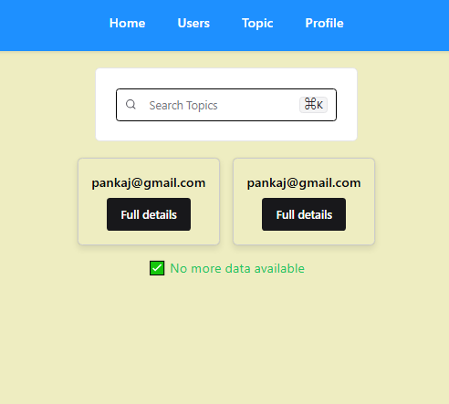
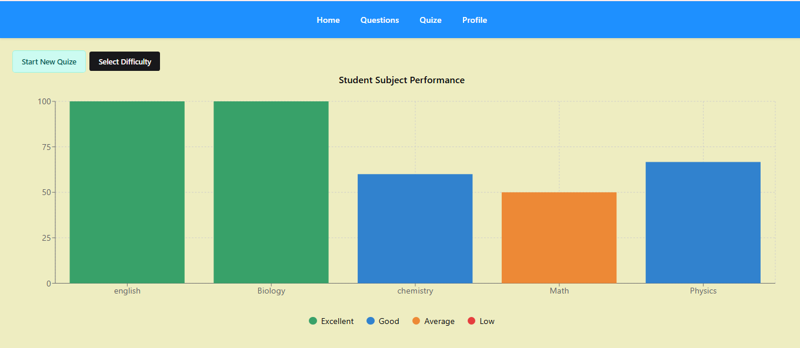
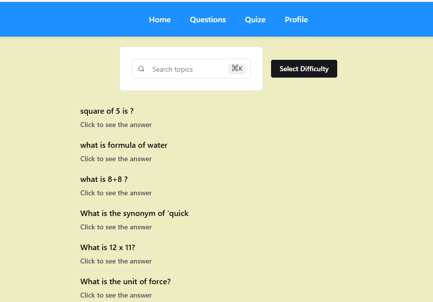
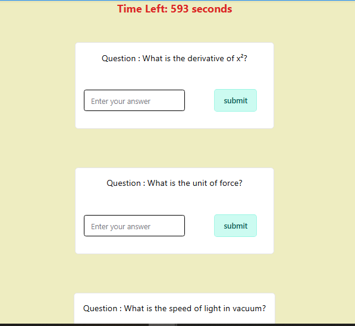

# 🎯 Full-Stack Quiz App

A full-featured **MERN-based Quiz Application** with Admin and Student panels. The app allows users to register/login, attend timed quizzes, and view results — while the admin manages questions, topics, and users efficiently.

---

## 🚀 Live Links

- **Frontend:** [https://quize-frontend.vercel.app](https://quize-frontend.vercel.app)
- **Backend API:** [https://quize-app-es62.onrender.com](https://quize-app-es62.onrender.com)

---

## 🧠 Features

### 🧑‍🎓 For Students:
- ✅ Sign up / Login using JWT auth
- ✅ Select quiz difficulty (Easy, Medium, Hard)
- ✅ Attempt questions in a **timed** quiz (10 mins)
- ✅ Auto-submit when timer ends
- ✅ Answer status tracked (Correct / Incorrect)
- ✅ Final score calculation

### 🧑‍💼 For Admins:
- ✅ Add/Edit/Delete Questions
- ✅ Create Topics & Quizzes
- ✅ View User Attempts & Scores
- ✅ Full quiz performance tracking

---

## 🖼️ Preview Screenshots

### 👨‍💼 Admin: Data Upload


---

### 👥 Admin: User Control Panel


---

### 📊 Quiz Performance


---

### ❓ Question Page


---

### 📝 Quiz Panel


---

## 🧰 Tech Stack

- **Frontend:** React, Chakra UI, Axios, Vite
- **Backend:** Node.js, Express.js
- **Database:** MongoDB (Mongoose)
- **Authentication:** JWT (Access + Refresh Tokens)
- **Deployment:** Vercel (Frontend), Render (Backend)
- **State Management:** Redux Toolkit

---

## 🛠️ Setup Instructions

### 🔽 Clone the Repo

```bash
git clone https://github.com/your-username/quiz-app.git
cd quiz-app
